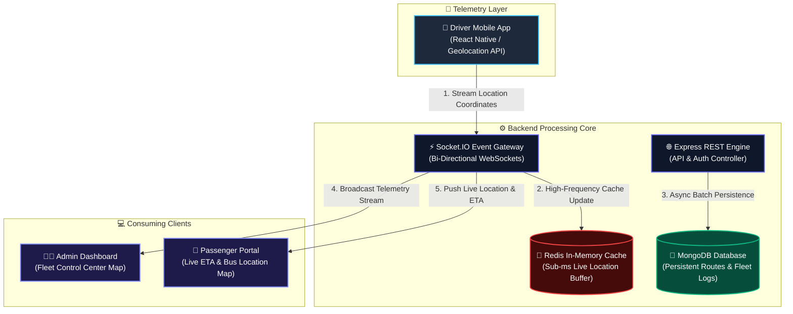

<div align="center">

  <br />

  

  <br />
  <br />

  <h1>🚌 Real-Time Smart Bus Tracking & Telemetry System</h1>

  <p align="center">
    <b>A Enterprise-Grade, Distributed Public Transit Telemetry & Fleet Management Platform</b>
    <br />
    <i>Powering sub-second location streaming, dynamic ETA predictions, and centralized transit control.</i>
  </p>

  <p align="center">
    <a href="https://adminweb-bustracking.netlify.app/drivers" target="_blank">
      
    </a>
    &nbsp;
    <a href="https://bus-tracking-userweb.netlify.app/bus/bPzRz_wOtRo5F" target="_blank">
      
    </a>
  </p>

  <p align="center">
    <a href="https://github.com/Akashjadhav32/-Real-Time-Bus-tracking-Syteem/stargazers">
      
    </a>
    <a href="https://github.com/Akashjadhav32/-Real-Time-Bus-tracking-Syteem/network/members">
      
    </a>
    <a href="https://github.com/Akashjadhav32/-Real-Time-Bus-tracking-Syteem/blob/main/LICENSE">
      
    </a>
    
    
  </p>

  <br />

  <table>
    <tr>
      <td align="center" width="25%">
        <b>⚡ Sub-100ms Latency</b><br/>
        <sub>Real-time WebSocket telemetry</sub>
      </td>
      <td align="center" width="25%">
        <b>🔴 Redis Powered</b><br/>
        <sub>In-memory location cache</sub>
      </td>
      <td align="center" width="25%">
        <b>📱 4-Tier Ecosystem</b><br/>
        <sub>Decoupled microservices</sub>
      </td>
      <td align="center" width="25%">
        <b>📴 Offline Resilient</b><br/>
        <sub>Driver telemetry buffering</sub>
      </td>
    </tr>
  </table>

  <br />

  <p align="center">
    <a href="#-project-overview">Overview</a> •
    <a href="#-repository-ecosystem">Repositories</a> •
    <a href="#-system-architecture">Architecture</a> •
    <a href="#-key-features">Key Features</a> •
    <a href="#-tech-stack">Tech Stack</a> •
    <a href="#-live-demos">Demos</a> •
    <a href="#-engineering-challenges--solutions">Challenges</a> •
    <a href="#-getting-started">Setup</a>
  </p>

</div>

---

## 📌 Project Overview

The **Smart Transport Tracking System** is a distributed, event-driven public transit tracking ecosystem built to solve urban transit unpredictability.

By seamlessly connecting mobile driver devices, high-throughput backend services, and interactive web maps, the platform processes real-time GPS telemetry from transit fleets and broadcasts updated locations and estimated arrival times (ETA) to commuters in sub-seconds.

> [!IMPORTANT]
> **Showcase Repository**: This repository acts as the flagship landing page and architectural blueprint. The complete implementation is modularized across **4 independent repositories** designed for micro-deployment pipelines.

---

## 📂 Repository Ecosystem

The source code is partitioned into four decoupled repositories for clean separation of concerns and independent CI/CD scaling:

<table width="100%">
  <thead>
    <tr>
      <th width="25%">Repository</th>
      <th width="20%">Role / Focus</th>
      <th width="35%">Tech Stack</th>
      <th width="20%">Action</th>
    </tr>
  </thead>
  <tbody>
    <tr>
      <td><b>🧑‍💻 <a href="https://github.com/Akashjadhav32/Tracking_bus_adminweb">Admin Dashboard</a></b></td>
      <td>Fleet Operations & Analytics</td>
      <td>
        
        
        
      </td>
      <td><a href="https://github.com/Akashjadhav32/Tracking_bus_adminweb"><code>View Code →</code></a></td>
    </tr>
    <tr>
      <td><b>👤 <a href="https://github.com/Akashjadhav32/Tracking_bus_Userweb">User Web Portal</a></b></td>
      <td>Passenger Live Tracking & ETA</td>
      <td>
        
        
        
      </td>
      <td><a href="https://github.com/Akashjadhav32/Tracking_bus_Userweb"><code>View Code →</code></a></td>
    </tr>
    <tr>
      <td><b>📱 <a href="https://github.com/Akashjadhav32/Tracking_bus_driverapp">Driver Application</a></b></td>
      <td>GPS Telemetry Streamer</td>
      <td>
        
        
      </td>
      <td><a href="https://github.com/Akashjadhav32/Tracking_bus_driverapp"><code>View Code →</code></a></td>
    </tr>
    <tr>
      <td><b>⚙️ <a href="https://github.com/Akashjadhav32/Tracking_bus_backend">Backend Service</a></b></td>
      <td>Gateway, Cache & Storage</td>
      <td>
        
        
        
      </td>
      <td><a href="https://github.com/Akashjadhav32/Tracking_bus_backend"><code>View Code →</code></a></td>
    </tr>
  </tbody>
</table>

---

## 🏗️ System Architecture

The architecture enforces an **Event-Driven Telemetry Pipeline** using WebSockets for pub/sub communication and Redis for sub-millisecond location caching:



<details>
<summary><b>🔍 Click to View Detailed Telemetry Data Flow Blueprint</b></summary>

<br />

```
┌─────────────────┐       GPS Stream       ┌────────────────────────┐
│  Driver Mobile  │ ─────────────────────> │  Socket.IO Gateway     │
│   Application   │                        └───────────┬────────────┘
└─────────────────┘                                    │
                                           ┌───────────┴───────────┐
                                           ▼                       ▼
                                ┌─────────────────────┐ ┌────────────────────┐
                                │ Redis Location Cache│ │ MongoDB Storage    │
                                │ (Key: bus:{id}:loc) │ │ (Trip History Logs)│
                                └──────────┬──────────┘ └────────────────────┘
                                           │
                                ┌──────────┴──────────┐
                                ▼                     ▼
                     ┌────────────────────┐ ┌────────────────────┐
                     │  Admin Dashboard   │ │  Passenger Portal  │
                     │  (Fleet Control)   │ │ (Live Bus Track)   │
                     └────────────────────┘ └────────────────────┘
```
</details>

---

## ✨ Key Features Matrix

<table width="100%">
  <tr>
    <td width="50%" valign="top">
      <h3>📱 Driver Application</h3>
      <ul>
        <li><b>Live GPS Streaming</b>: High-accuracy location transmission over WebSockets.</li>
        <li><b>Offline Resilience</b>: Automatic local coordinate queuing when connection drops.</li>
        <li><b>Emergency Alerts</b>: One-tap dispatch for accidents or breakdown reporting.</li>
        <li><b>Shift Controls</b>: Start/stop route tracking with driver duty status toggles.</li>
      </ul>
    </td>
    <td width="50%" valign="top">
      <h3>👤 Passenger Web Portal</h3>
      <ul>
        <li><b>Real-Time Map</b>: Live animated bus icons moving across route paths.</li>
        <li><b>Instant ETA Engine</b>: Dynamic arrival time predictions updated per second.</li>
        <li><b>Zero-Refresh UI</b>: Pure WebSocket telemetry updates without page reloads.</li>
        <li><b>Bus Stop Directory</b>: Interactive station selection & route schedules.</li>
      </ul>
    </td>
  </tr>
  <tr>
    <td width="50%" valign="top">
      <h3>🖥️ Admin Dashboard</h3>
      <ul>
        <li><b>Central Fleet Overview</b>: Track all active buses, drivers, and speeds on one map.</li>
        <li><b>Route & Driver Management</b>: Full CRUD control over transit schedules and vehicles.</li>
        <li><b>Live Incident Desk</b>: Instant notifications for route deviations or delays.</li>
        <li><b>System Analytics</b>: Operational metrics on transit efficiency & delay logs.</li>
      </ul>
    </td>
    <td width="50%" valign="top">
      <h3>⚙️ Backend Engine</h3>
      <ul>
        <li><b>High-Concurrency Gateway</b>: Managed by Socket.IO & Node.js event loop.</li>
        <li><b>Redis Location Caching</b>: Eliminates database I/O bottlenecks during peak traffic.</li>
        <li><b>RESTful Management API</b>: Clean JSON endpoints for route and user authentication.</li>
        <li><b>Role-Based Auth</b>: JWT security layers for drivers and transit admins.</li>
      </ul>
    </td>
  </tr>
</table>

---

## 🛠️ Tech Stack & Ecosystem Tools

<table align="center">
  <tr>
    <th width="20%">Category</th>
    <th width="80%">Technologies & Frameworks</th>
  </tr>
  <tr>
    <td><b>Frontend Web</b></td>
    <td>
      <a href="https://react.dev/"></a>
      <a href="https://vitejs.dev/"></a>
      <a href="https://leafletjs.com/"></a>
      <a href="https://developer.mozilla.org/en-US/docs/Web/JavaScript"></a>
    </td>
  </tr>
  <tr>
    <td><b>Mobile Stack</b></td>
    <td>
      <a href="https://reactnative.dev/"></a>
      <a href="https://developer.android.com/"></a>
      <a href="https://w3c.github.io/geolocation-api/"></a>
    </td>
  </tr>
  <tr>
    <td><b>Backend Services</b></td>
    <td>
      <a href="https://nodejs.org/"></a>
      <a href="https://expressjs.com/"></a>
      <a href="https://socket.io/"></a>
    </td>
  </tr>
  <tr>
    <td><b>Data & Cache</b></td>
    <td>
      <a href="https://www.mongodb.com/"></a>
      <a href="https://redis.io/"></a>
    </td>
  </tr>
  <tr>
    <td><b>Hosting & CI/CD</b></td>
    <td>
      <a href="https://www.netlify.com/"></a>
      <a href="https://github.com/"></a>
    </td>
  </tr>
</table>

---

## 🌐 Live Demos

Test the production builds live in your browser:

<div align="center">

  <table width="90%">
    <tr>
      <td align="center" width="50%">
        <h3>🧑‍💻 Admin Dashboard</h3>
        <p>Real-time fleet monitoring, route creation & driver controls.</p>
        <a href="https://adminweb-bustracking.netlify.app/drivers" target="_blank">
          
        </a>
      </td>
      <td align="center" width="50%">
        <h3>👤 Passenger Portal</h3>
        <p>Live bus location tracking & accurate ETA predictions.</p>
        <a href="https://bus-tracking-userweb.netlify.app/bus/bPzRz_wOtRo5F" target="_blank">
          
        </a>
      </td>
    </tr>
  </table>

</div>

> [!TIP]
> Open both portals in separate browser tabs to experience instant WebSocket telemetry synchronization!

---

## 📸 Interface Previews

<details open>
<summary><b>🖼️ Click to Toggle Visual Interface Showcase</b></summary>

<br/>

<table align="center" width="100%">
  <tr>
    <td align="center" width="50%">
      <b>🧑‍💻 Admin Control Panel</b><br/><br/>
      
      <br/><sub>Fleet map overview, active driver lists, and breakdown alerts.</sub>
    </td>
    <td align="center" width="50%">
      <b>👤 Passenger Live Tracking UI</b><br/><br/>
      
      <br/><sub>Live bus marker movement with dynamic ETA counter.</sub>
    </td>
  </tr>
  <tr>
    <td align="center" colspan="2">
      <br/>
      <b>📱 Driver Mobile App Telemetry Interface</b><br/><br/>
      
      <br/><sub>One-tap GPS transmission switch, route progress, and incident reporting.</sub>
    </td>
  </tr>
</table>

</details>

---

## ⚡ Engineering Challenges & Solutions

> [!WARNING]
> **Challenge 1: High-Frequency Database Write Bottlenecks**
> * **Problem**: Streaming GPS updates every 2 seconds from hundreds of active buses caused disk I/O spikes and high CPU utilization on MongoDB.
> * **Solution**: Built an **In-Memory Redis Pub/Sub Cache**. Incoming coordinates overwrite Redis keys in sub-milliseconds (`bus:{id}:location`), serving read requests instantly while MongoDB persists trip summaries asynchronously.

> [!NOTE]
> **Challenge 2: Intermittent Cellular Connectivity**
> * **Problem**: Mobile signal drops along rural transit routes led to lost coordinates and broken map trajectories.
> * **Solution**: Developed an **Offline Telemetry Queue** inside the React Native driver app. Unsent GPS payloads are buffered locally with Unix timestamps and re-transmitted in batch upon network re-establishment.

> [!TIP]
> **Challenge 3: Mobile Battery Drain Optimization**
> * **Problem**: Continuous high-rate location background services drained driver device batteries rapidly.
> * **Solution**: Engineered **Velocity-Adaptive Polling**. Stationary buses at stops drop polling rates to 15s intervals, while moving buses scale up to 2s intervals to balance telemetry accuracy with power conservation.

---

## 💻 Getting Started (Local Development)

To run the complete ecosystem locally, clone the individual components and start the backend service:

```bash
# 1. Clone the Backend Gateway
git clone https://github.com/Akashjadhav32/Tracking_bus_backend.git
cd Tracking_bus_backend
npm install

# 2. Configure Environment Variables (.env)
PORT=5000
MONGO_URI=mongodb://localhost:27017/bus_tracking
REDIS_HOST=localhost
REDIS_PORT=6379

# 3. Start Backend Engine
npm run dev

# 4. In a new terminal, launch Admin or Passenger Web
git clone https://github.com/Akashjadhav32/Tracking_bus_adminweb.git
cd Tracking_bus_adminweb
npm install && npm run dev
```

---

## 🔮 Roadmap & Future Scope

- [ ] **AI-Powered Traffic ETA**: Integrate machine learning models for dynamic traffic congestion forecasting.
- [ ] **Passenger Geofence Alerts**: Send automated push notifications when a bus is 2 stops away.
- [ ] **GTFS-Realtime Specification**: Export standardized GTFS feeds for integration with Google Maps Transit.
- [ ] **Multilingual Support**: Provide localization options for municipal transit systems worldwide.

---

## 🤝 Contributor

<table align="center">
  <tr>
    <td align="center">
      <a href="https://github.com/Akashjadhav32">
        <br />
        <sub><b>Akash Jadhav</b></sub>
      </a><br />
      👑 <i>Lead Systems Architect & Full-Stack Engineer</i>
    </td>
  </tr>
</table>

Contributions, issues, and feature suggestions are welcome! Feel free to open an issue or submit a pull request on any of the core repositories.

---

## 📜 License

This project is licensed under the **MIT License** - see the [LICENSE](LICENSE) file for details.

---

<div align="center">
  <sub>Built with ❤️ for scalable, reliable public transportation. Don't forget to star ⭐ the repository!</sub>
</div>
